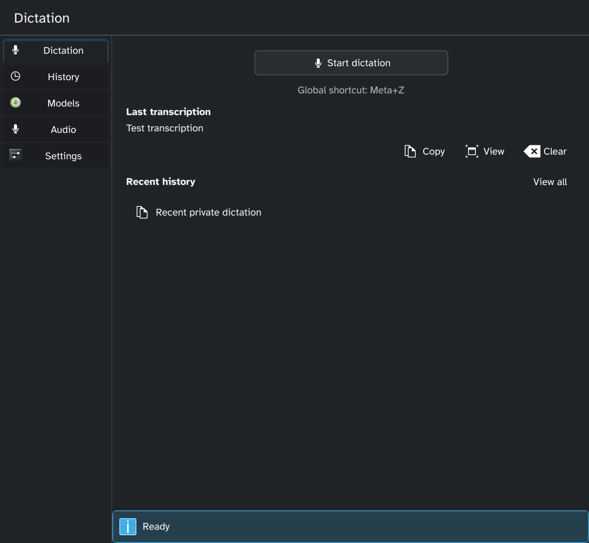
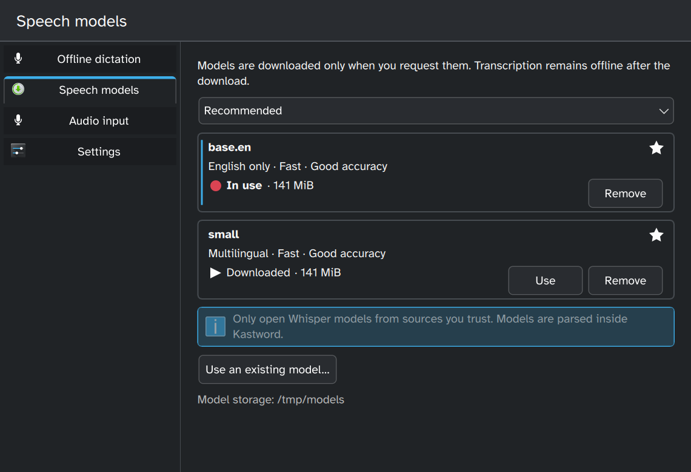
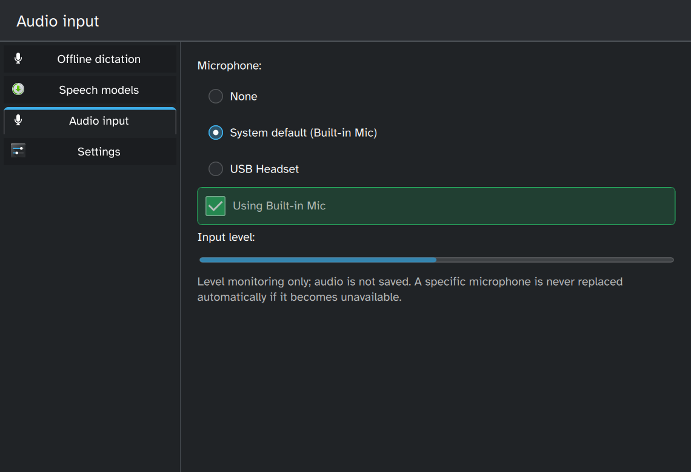
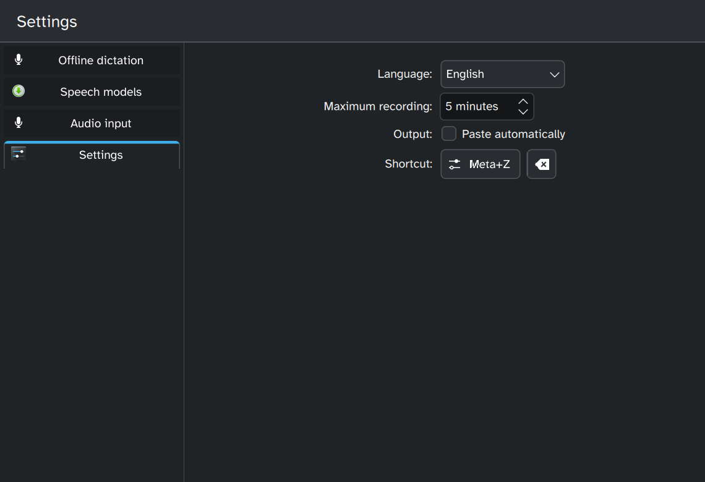

<!--
SPDX-FileCopyrightText: 2026 Sri Rang
SPDX-License-Identifier: GPL-3.0-or-later
-->

# Kastword

[](https://github.com/Shape-Machine/Kastword/actions/workflows/ci.yml)

**Private, offline dictation built for KDE Plasma.**

Kastword records your voice, transcribes it locally with Whisper, and places the result on your
clipboard. It can optionally paste the text into the application you were using. Dictated audio and
text are never sent to a cloud transcription service.

> [!WARNING]
> Kastword is early alpha software. This repository currently provides source code only—there are
> no supported binary releases or stable compatibility guarantees yet.

<table>
  <tr>
    <td></td>
    <td></td>
  </tr>
  <tr>
    <td></td>
    <td></td>
  </tr>
</table>

## Why Kastword?

- **Local transcription:** speech recognition runs on your computer using a model you choose.
- **Tray-first workflow:** start and stop dictation with a configurable KDE global shortcut,
  **Meta+Z** by default.
- **Your microphone, your choice:** follow the system default, select a specific device, or disable
  microphone access from the application. Kastword handles downmixing, resampling, and device
  hot-plug events without silently replacing a disconnected specific device.
- **Manage models in the app:** download, verify, resume, switch, inspect, or remove supported
  English-only and multilingual Whisper models.
- **Useful anywhere:** copy text to the clipboard, then paste manually or enable optional automatic
  paste on Plasma Wayland or X11.
- **Configurable limits and output:** choose the transcription language, recording limit, paste
  shortcuts, and global keyboard shortcut.
- **No history or telemetry:** Kastword does not save recordings, retain a transcription history,
  or include usage tracking.

## How dictation works

1. Start Kastword and explicitly download a recommended Whisper model, or select a compatible
   model already on your computer.
2. Focus the text field or terminal where you want the result.
3. Press **Meta+Z**, speak, then press it again.
4. Kastword transcribes the recording locally and updates the clipboard.
5. Paste manually, or let Kastword send your configured paste shortcut when automatic paste is
   enabled and its helper is available.

The window can be opened or hidden from the tray icon. The tray menu can also start or stop
dictation and quit the application.

Dictation remains disabled until both a valid model and an available audio input are selected. The
Speech Models view shows model disk usage and can resume or retry interrupted downloads. If a
specifically selected microphone disconnects, Kastword waits for it to return or for you to choose
another input instead of silently switching devices.

## Privacy and trust

- Microphone samples remain in process memory only until transcription completes. Recordings stop
  at the configured duration limit—five minutes by default—or a 256 MiB raw-audio ceiling.
- Raw audio and transcription history are not written to disk.
- Transcribed text is placed on the desktop clipboard and primary selection. Clipboard managers,
  target applications, desktop services, crash dumps, and the operating system may retain it
  independently of Kastword.
- Runtime network access occurs only when you explicitly request a model download. Downloads use
  immutable HTTPS URLs and are activated only after size, format, and SHA-256 verification.
  Transcription itself remains offline.
- Downloaded models remain in per-user local storage under `~/.local/share/kastword/models/` by
  default. Custom model files are trusted input parsed inside Kastword, so use models from sources
  you trust.
- Automatic paste is disabled by default and relies on separately installed desktop helpers. See
  [Automatic paste setup and security](docs/AUTOMATIC_PASTE.md).
- Kastword refuses to run with elevated privileges and contains no telemetry.

The clear-transcription action removes Kastword's retained text and clears matching current
clipboard selections. It cannot erase entries already retained by clipboard-manager history.

## Platform status

| Environment | Status |
| --- | --- |
| KDE Plasma Wayland | Manually exercised during development |
| KWrite | Dictation and automatic paste exercised |
| Konsole | Dictation and automatic paste exercised |
| Plasma X11 | Implemented but needs broader testing |
| Other distributions and desktops | Community testing needed |

Kastword is an independent project built with KDE technology; it is not currently an official KDE
project or endorsed by KDE e.V.

## Build from source

There are no supported binary packages yet. On a supported development system, install the
[documented dependencies](docs/DEVELOPMENT.md#dependencies), then run:

```sh
make
make install
```

Launch Kastword from the application menu. Detailed build, run, packaging, uninstall, and
contributor instructions are in the [development guide](docs/DEVELOPMENT.md).

## Known limitations

- Full-size Large models require substantial disk space and memory.
- Paste reliability depends on the desktop session, helper, focus, and target application.
- Plasma Wayland automatic paste requires privileged input-device access configured outside
  Kastword.
- Plasma X11 and environments outside the tested Plasma setup need broader community testing.
- There are no supported binary packages or release builds yet.

## Help and project information

- [Automatic paste setup and troubleshooting](docs/AUTOMATIC_PASTE.md)
- [Source installation and development](docs/DEVELOPMENT.md)
- [Report a bug or request a feature](https://github.com/Shape-Machine/Kastword/issues)
- [License](LICENSES/GPL-3.0-or-later.txt)

Kastword is licensed under `GPL-3.0-or-later`. AppStream metadata is provided under `CC0-1.0`.
Third-party components retain their own licenses.
